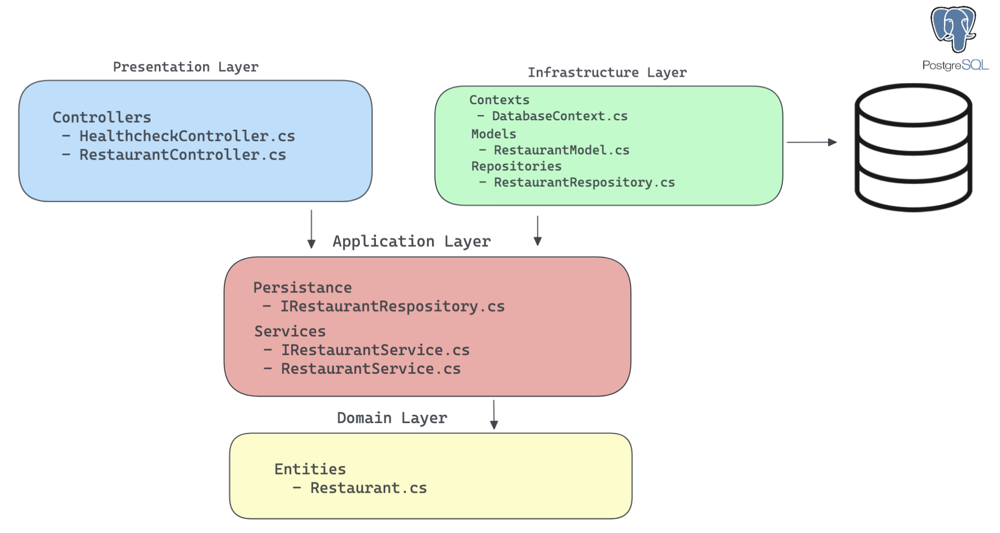
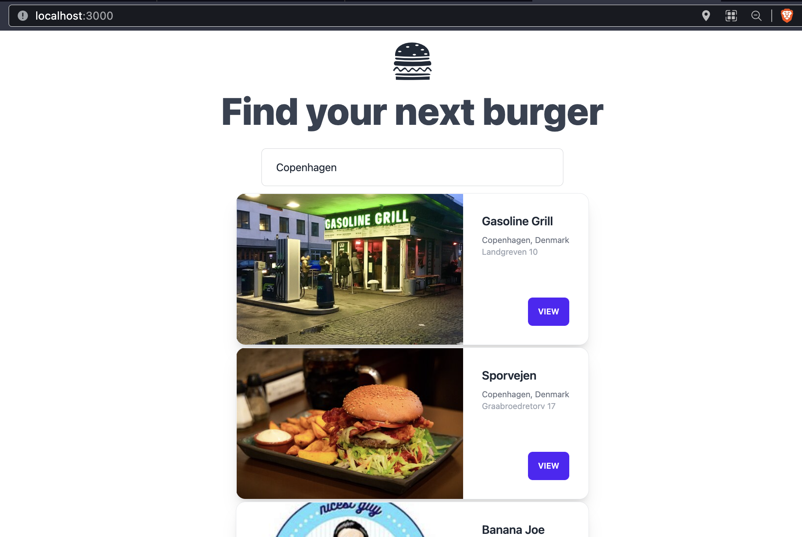

# Borgir

Find Burger places in your city and [check reviews (wip)]
Small pet project to experiment with C# and .Net framework.

Initial project setup following Clean Architecture

---

## Technologies used:

### Backend

- .Net 6
- PostgreSQL

### Frontend

- NextJS
- TailwindCSS

---

## How to run project locally:

### Prerequisites:

- docker
- dotnet cli

---

### Steps:

- Clone the repository and `cd` into it

- Start PostgreSQL docker container (from project root)

> `$ docker compose up -d`

- Run backend

> `$ cd backend`

> `$ dotnet watch --project Borgir.Api`

in new terminal window/tab

- Frontend: install dependencies and run app

> `$ cd frontend`

> `$ npm/pnpm install`

> `$ npm/pnpm run dev`

---

Backend should start on port:

- `https://localhost:7002`

And Frontend on port:

- `http://localhost:3000/`

### Use search field to input either `Copenhagen` or `Antalya` to get results.

Currently there are only 6 restaurants seeded into the database.

